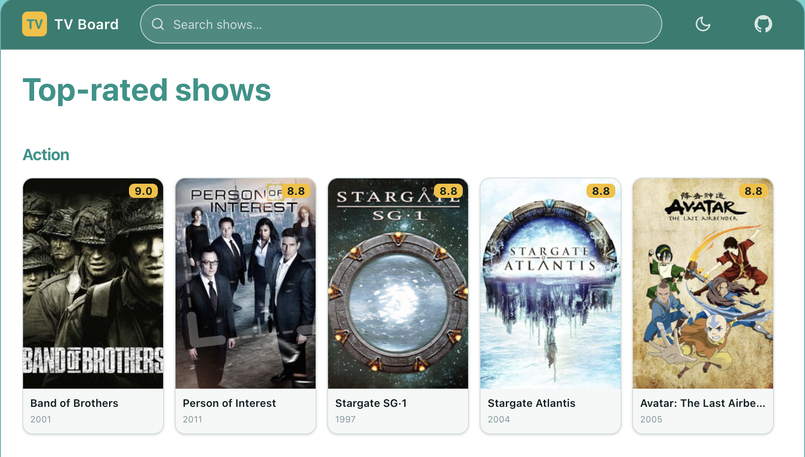

# TV Show Board

> **Demo:** [_link coming soon_](#)

A TV show discovery dashboard built with Vue 3. Browse top-rated shows grouped by genre, view full show and cast details, and search by title — all with dark/light theme support.



## Setup

```sh
# 1. Clone
git clone https://github.com/<you>/tv-show-board.git
cd tv-show-board

# 2. Install dependencies
npm install

# 3. Start the dev server
npm run dev
```

Open [http://localhost:5173](http://localhost:5173).

---

## Tech Stack

| Concern    | Choice                  | Why                                                       |
| ---------- | ----------------------- | --------------------------------------------------------- |
| Framework  | Vue 3 (Composition API) | Modern standard; `<script setup>` + composables           |
| Language   | TypeScript              | Type safety, better DX, fewer runtime surprises           |
| State      | Pinia                   | Official Vue store — simple, modular, TS-first            |
| Routing    | Vue Router 5            | Lazy-loaded routes, typed route names                     |
| Build      | Vite                    | Near-instant HMR, zero-config                             |
| Styling    | Tailwind CSS 4          | Utility-first; CSS custom properties for theming          |
| i18n       | vue-i18n                | Composition mode, namespaced messages, type-safe keys     |
| Unit tests | Vitest + Vue Test Utils | Native Vite integration, Jest-compatible API              |
| E2E tests  | Playwright              | Reliable cross-browser automation                         |
| Linting    | oxlint + ESLint         | Rust-speed first pass + Vue/TS rule extensions            |
| Formatting | Prettier                | Class ordering enforced via `prettier-plugin-tailwindcss` |
| Security   | DOMPurify               | Sanitises TVMaze HTML descriptions against XSS            |

---

## Architecture

The `src/` tree has three top-level buckets:

```
src/
├── shell/        # App frame — header, layout, 404 (used once)
├── features/     # Domain capabilities — dashboard, details, search, person
│   ├── dashboard/
│   ├── details/
│   ├── person/
│   └── search/
└── shared/       # Reusable building blocks (used by 2+ features)
    ├── api/          # TVMaze HTTP client + raw response types + mappers
    ├── components/
    ├── composables/
    ├── i18n/
    ├── stores/
    ├── services/
    ├── types/        # Domain types (Show, Person, …)
    └── utils/
```

---

## Scripts

| Script                       | What it does                                  |
| ---------------------------- | --------------------------------------------- |
| `npm run dev`                | Start Vite dev server with HMR                |
| `npm run build`              | Type-check + production build                 |
| `npm run preview`            | Preview the production build locally          |
| `npm run type-check`         | Run `vue-tsc` without emitting                |
| `npm run lint`               | Run oxlint + ESLint (with auto-fix)           |
| `npm run lint:check`         | Lint without fixing (used in CI)              |
| `npm run format`             | Format `src/` with Prettier                   |
| `npm run format:check`       | Check formatting without writing (used in CI) |
| `npm run test:unit`          | Run Vitest in watch mode                      |
| `npm run test:unit:coverage` | Run Vitest once with V8 coverage report       |
| `npm run test:e2e`           | Run Playwright E2E suite                      |
| `npm run test:e2e:ui`        | Open Playwright UI mode                       |

---

## E2E Tests

E2E tests use Playwright and live in `e2e/`. They run against a production build served locally, using route-level network mocking (no real TVMaze calls).

```sh
# First time: install browsers
npx playwright install chromium

# Run all E2E tests
npm run test:e2e

# Open interactive UI mode
npm run test:e2e:ui
```

---

## CI

GitHub Actions runs two jobs on every push to `main` and on pull requests:

| Job     | Steps                                                                         |
| ------- | ----------------------------------------------------------------------------- |
| **ci**  | type-check → lint → format check → unit tests → build                         |
| **e2e** | install Playwright browsers → build → Playwright / Chromium (runs after `ci`) |

Workflow file: [`.github/workflows/ci.yml`](.github/workflows/ci.yml)

---

## Deployment

_Coming soon — see [Plan item 4.3](docs/PLAN.md)._
